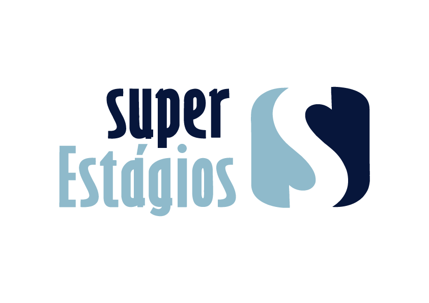

# Super Estágios

A "Super Estágios" é uma plataforma dedicada à integração entre universitários que desejam realizar seu primeiro estágio ou que estão a procura de novas oportunidades dentro de suas áreas de estudos, contam ainda com  empresas que desejam incorporar seus times de trabalhos com alunos selecionados.                                                                           A empresa oferece serviços como divulgação de vagas de estágios, recrutamento, além da seleção de candidatos e gestão dos seus programas de estágios.

*Fonte: [Super Estágios](https://www.superestagios.com.br/index)*

**Figura 1: Logo Super Estágios**

*Fonte: [Super Estágios](https://www.superestagios.com.br/index)*

## Sobre o Projeto
Repositório de documentação do "Grupo 05" na Disciplina de Interação Humano Computador - FGA0173, ministrada pelo Prof. Dr. Andre Barros de Sales em 2026.1 na Universidade de Brasília.
Este repositório é dedicado a avaliação do site "superestagios.com.br". O nosso objetivo principal com esse trabalho é buscar por problemas no site que atrapalham a jornada de um usuário, além da usabilidade que pode resultar em violações dos princípios da Interação Humano Computador.

## Equipe

| |  |  |  |  |
| :---: | :---: | :---: | :---: | :---: |
| **ARTHUR MEZZAROBA SCARTEZINI** | **LUIS GUSTAVO LOPES OLIVEIRA** | **MARIANA MARTINS SILVA** | **PEDRO HENRIQUE FERREIRA XAVIER** | **SAMUEL DE SOUZA LEITE** |

## Acesso à Documentação

Via link:
https://interacao-humano-computador.github.io/2026.1-Grupo05/

A geração do site estático é realizada utilizando o docsify.

Execute o comando no seu terminal para instalar a ferramenta globalmente:

> npm i docsify-cli -g

Para visualizar localmente, utilize o comando:

> docsify serve ./docs

### Histórico de Versões

| Data | Versão | Descrição | Autor | Revisor |
| :---: | :---: | :--- | :--- | :--- |
| 09/04/2026 | 1.0 | Criação do repositório e estrutura Docsify | Mariana Martins | Arthur Mezzaroba |
| 11/04/2026 | 1.1 | Adição da descrição e logo | Mariana Martins | Pedro Henrique |
| 30/04/2026 | 1.2 | Atualização com o novo site | Luís Oliveira | Mariana Martins |
| 01/05/2026 | 1.3 | Atualização da descrição | Mariana Martins | Pedro Henrique |
