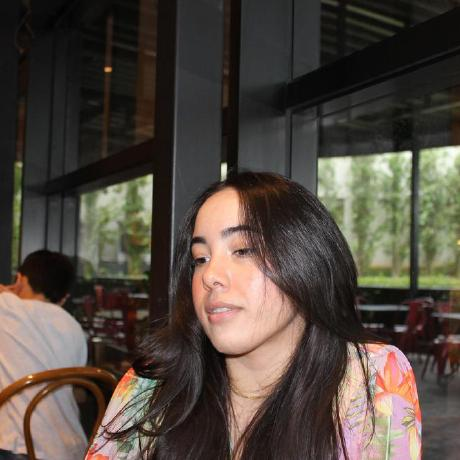
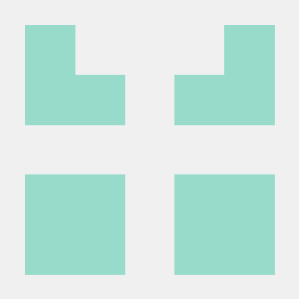

# Agenda DF (Exame de curva Glicêmica)

Figura 1: Logo Agenda DF (Fonte: [AgendaDF](https://agenda.df.gov.br/index.html))

## Sobre o Projeto
Repositório de documentação do "Grupo 05" na Disciplina de Interação Humano Computador - FGA0173, ministrada pelo Prof. Dr. Andre Barros de Sales em 2026.1 na Universidade de Brasília.
Este repositório é dedicado a avaliação do site "Agenda.df.gov.br" especificamente em "Exame de curva glicêmica e Gestantes (24 a 28 semanas) e não gestantes". O nosso objetivo principal com esse trabalho é buscar por problemas no site que atrapalham a jornada de um usuário, além da usabilidade que pode resultar em violações dos princípios da Interação Humano Computador.

## Equipe

| |  |  |  |  |
| :---: | :---: | :---: | :---: | :---: |
| **ARTHUR MEZZAROBA SCARTEZINI** | **LUIS GUSTAVO LOPES OLIVEIRA** | **MARIANA MARTINS SILVA** | **PEDRO HENRIQUE FERREIRA XAVIER** | **SAMUEL DE SOUZA LEITE** |

## Acesso à Documentação

Via link:
https://interacao-humano-computador.github.io/2026.1-Grupo05/

A geração do site estático é realizada utilizando o docsify.

Execute o comando no seu terminal para instalar a ferramenta globalmente:

> npm i docsify-cli -g

Para visualizar localmente, utilize o comando:

> docsify serve ./docs

### Histórico de Versões

| Data | Versão | Descrição | Autor | Revisor |
| :---: | :---: | :--- | :--- | :--- |
| 09/04/2026 | 1.0 | Criação do repositório e estrutura Docsify | Mariana Martins | Arthur Mezzaroba |
