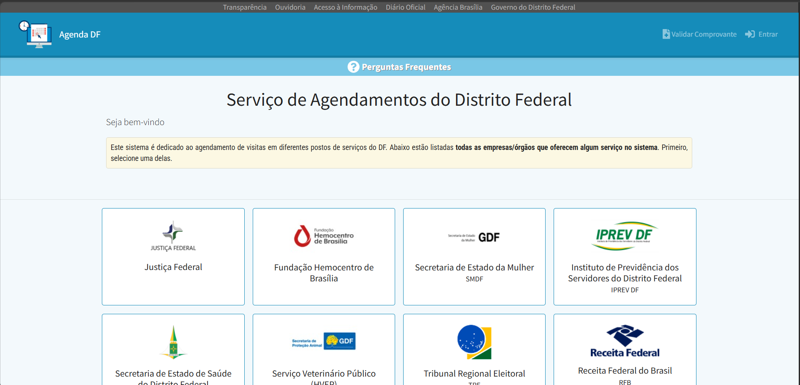
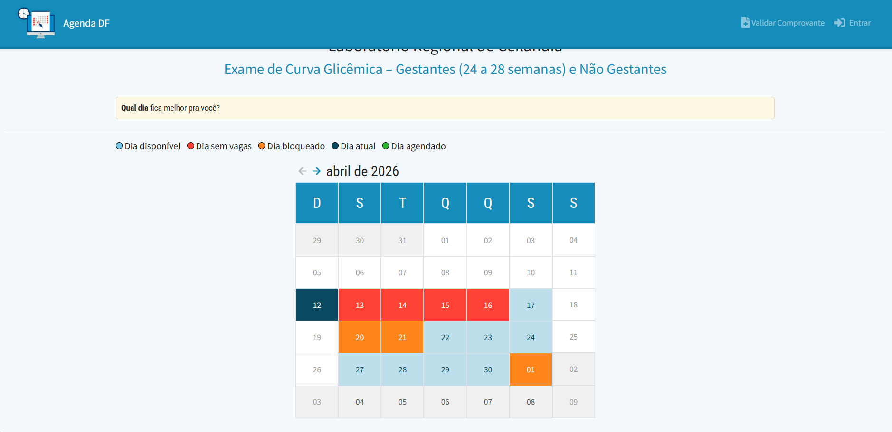
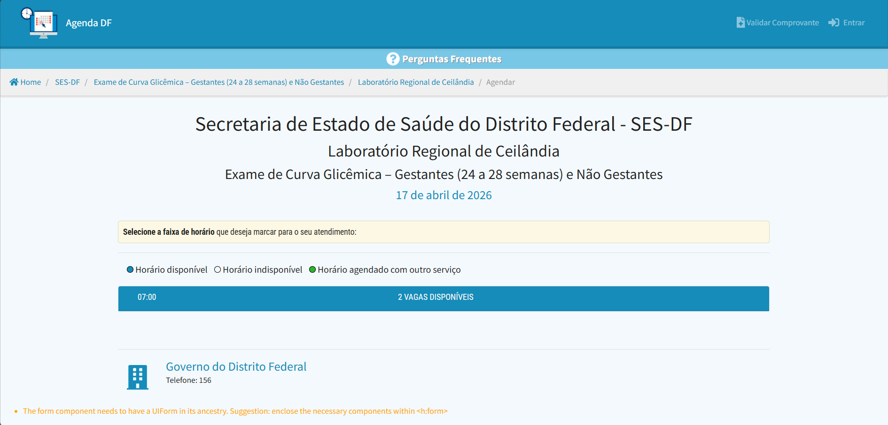
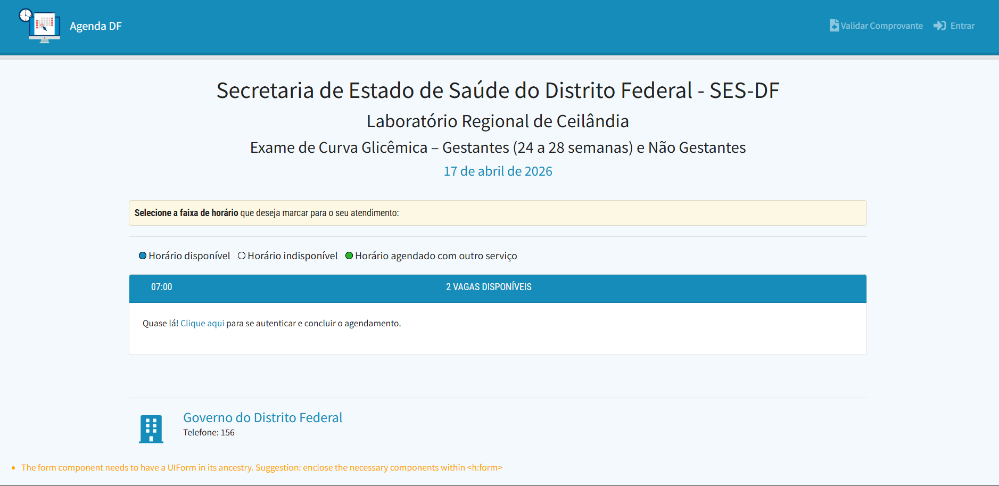
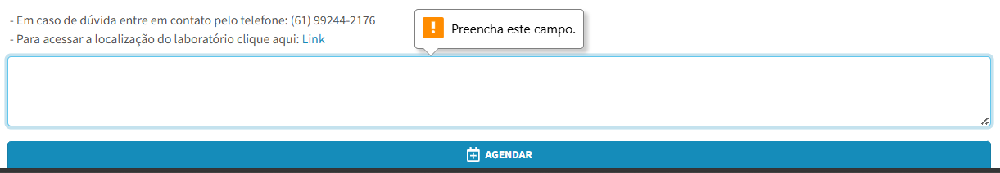

## Avaliação do site escolhido

Essa etapa da avaliação possui foco no conformidade com o padrão W3C para acessibilidade.
Avaliação Heurística do site de agendamento exame de curva glicêmica para Gestantes (24 a 48 semanas) e não gestantes, incluindo crianças, mediante solicitação médic _(Agenda-DF, SES-DF, acessado dia 10/04/2026)_

## 1- Etapa de Preparação: 

- **Objetivos da avaliação:** O objetivo principal é verificar se o site atende à conformidade com o padrão W3C para acessibilidade. A avaliação focará em descobrir se o design adotado possui ferramentas de acessibilidade adequadas e se facilita a operação para o público-alvo na realização de agendamentos de exame de curva glicêmica.

- **Escopo da Avaliação (O que avaliar)**: A parte da interface selecionada para inspeção é o Formulário de requisição de agendamento. 

- **Situação Atual e Domínio do Sistema:** O serviço avaliado possibilita que os usuários agendem exames antecedência, importante pare o acompanhamento pré-natal.

- **Definição do Usuário e do Problema** Para simular o papel dos usuários de forma eficaz, a inspeção baseia-se no seguinte perfil e contexto de uso: 

  - **Perfil do Usuário-Alvo:** O sistema tem como foco gestantes e não gestantes com grau baixa experiência com tecnologia que precisa realizar um agendamento de exame glicêmico.

  - **Tarefas do Usuário:** O usuário deve selecionar a disponível que melhor lhe atende para executar seu agendamento.

  - **Requisições e Reclamações:** O usuário deseja agendar uma visita, mas relata dificuldade em compreender a plataforma e sente que os recursos de apoio oferecidos não são suficientes, por isso desiste.

  - **Comportamento do Stakeholder:** O usuário enfrenta dificuldades ao realizar o atendimento quando esse demanda recursos especiais de acessibilidade, uso de leitores de tela 

## 2- Etapa de coleta de dados, interpretação e consolidação de resultados: 

1. **Caminho da Interação** Selecionado Para a avaliação, o avaliador percorrerá o seguinte caminho de interação:
    1. Acesso ao site do Agenda DF (https://agenda.df.gov.br/index.html). E buscar nos quadros disponíveis o quadro correspondente à "Secretaria de Estado de Saúde do Distrito Federal SES-DF".
        

            
            
        

    2. Fazer o Login com a conta GOV.BR. 
    3. Acessar “Exame de curva glicêmica - Gestantes (24 a 28 semanas) e Não Gestantes” no quadro de serviços.
        

            
        

    4. Selecionar a unidade de atendimento "Laboratório Regional de Ceilândia".
    
    
    5. Selecionar a Data disponível de acordo com o calendário exibido na tela.
    
    
    6. Selecionar o horário disponível.
    
    
    7. Preencher o campo de texto com as informações requisitadas no parágrafo de texto acima do campo.
    
    
    
# Avaliação Heurística

- **Visibilidade do estado do sistema, prevenção de erros**: Não existe em nenhum local algum idicativo de disponibilidade do sistema — _Sistema online_ — ou que informe o estado atual (exemplo: carregando, processando, aguarde ou outro similar). Para prevenção de erros, apenas aparece um balão de aviso "preencha esse campo" para evitar de submeter um agendamento vazio, porém esse campo aceita qualquer tipo de informação.

    - **Local:** Não existente nenhum elemento que indique o estado do sistema
    - **Severidade :** 3 (problema grande), O Usuário não sabe se o sistema de agendamento está ativo. e também não possui feedback a respeito do seu pedido.
        - **Frequência:** Problema comum.
        - **Impacto:** Baixo.
        - **Persistência:** Acontece repetidamente.

    - **Recomendação:** Colocar na barra superior algum elemento para indicar a disponibilidade do sistema. Inserir popup ou algum outro elemento animado para indicar o estado de processamento do sistema.

3. **Controle e liberdade do usuário:** Os usuários têm sim a possibilidade de voltar a um passo anterior, porém só volta uma etapa por vez, necessitando vários cliques para voltar várias páginas do formulário. 
    - **Local:** ausência de um botão de volta para o início do  formulário do site. 
    - **Severidade:** 2 (problema pequeno). O usuário está acostumado  a utilizar botão de voltar do navegador. 
    - **Recomendação:** incluir um botão Voltar para uma etapa específica. 

4. **Consistência e padronização, prevenção de erros:** Os campos de preenchimento alternativo não podem ser selecionados caso não haja atração disponível iv. 
    - **Local:** formulário de login, campos “Email:” e “ou CPF/CNPJ:”. 
    - **Severidade:** 2 (problema pequeno). Apesar de ineficiente, o 
preenchimento dos dois campos no impede o usuário de efetuar 
o login. 
    - **Recomendação:** identificar os campos alternativos por botões de opção, que devem ser automaticamente selecionados 
quando o usuário inicia a digita o no campo correspondente. 

5. **Flexibilidade e eficiência de uso, consistência e padronização:** O sistema recupera 
alguns dados do próprio cliente como nome completo e data de nascimento com base 
no CPF digitado, porém se ele desejar memorizar outras informações, o sistema não 
oferece de forma nativa, portanto deve recorrer a um recurso do navegador.  
    - **Local:** preenchimento de formulário 
    - **Severidade:** 2 (problema pequeno) para usuários ocasionais; 3 (problema 
grande) para usuários frequentes, que provavelmente darão preferência a Web 
sites que se lembrem “deles”.  
    - **Recomendação:** oferecer um checkbox ter meu login ativo por 15 dias. 

Página escolhida: agendamento de visita ecoturismo ICMBIO:

----------
nota de rodapé: 1 Acessibilidade: possibilidade de leitura com o agente de usuário. O Agente de Usuário referese ao software para ter acesso ao conteúdo web. Inclui 
navegadores gráficos, navegadores de texto, navegadores de voz, celulares, leitores de multimídia, suplementos para navegadores, como os leitores de tela e 
os programas de reconhecimento de voz.  Se um Agente de Usuário, como, por exemplo, um navegador ou um leitor de telas, não detectar o tipo de 
codificação de caracteres usado no documento web, o usuário corre o risco de ter em seu site um texto ininteligível.
2 Usabilidade: produtividade, eficiência de uso e funcionalidade do ambiente – facilidade de acesso para TODOS.
3 Comunicabilidade: processo de comunicação desenvolvedorusuário; mede o nível de compreensão do usuário. É preciso que o usuário compreenda cada 
evento contido na interface, que os dados/informações presentes na mesma sejam transmitidos com clareza

