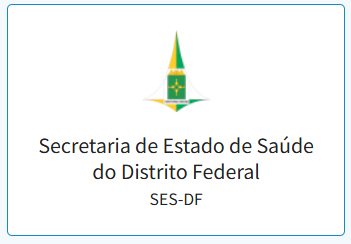
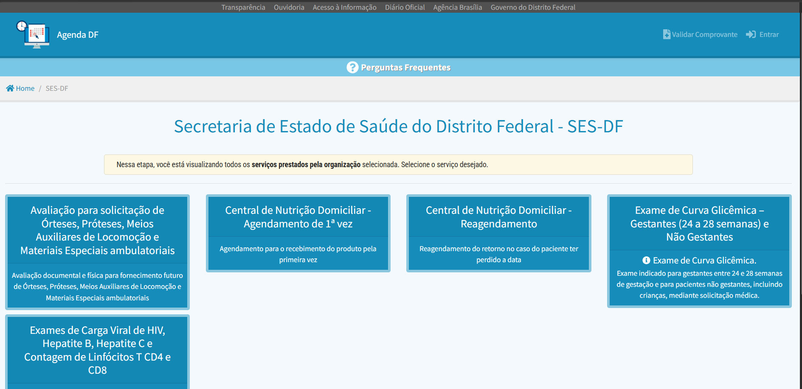
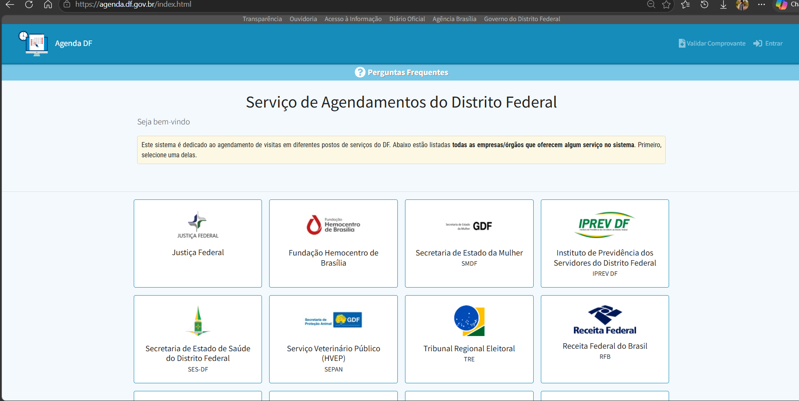
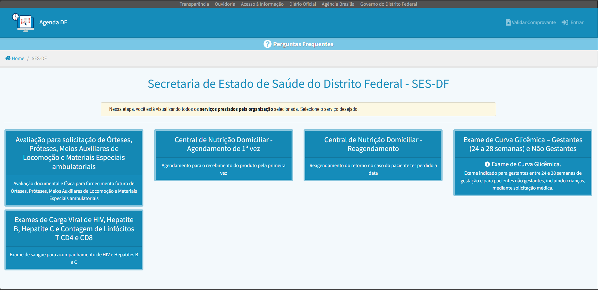
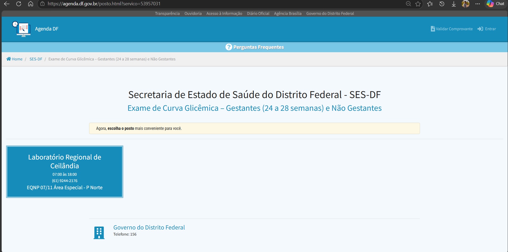
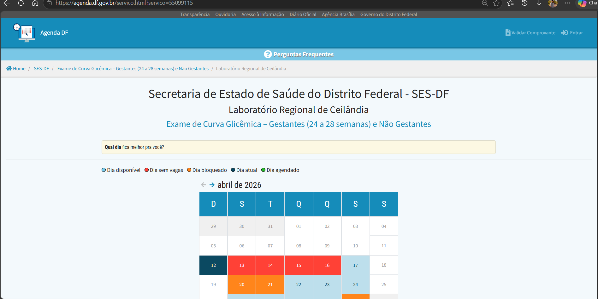
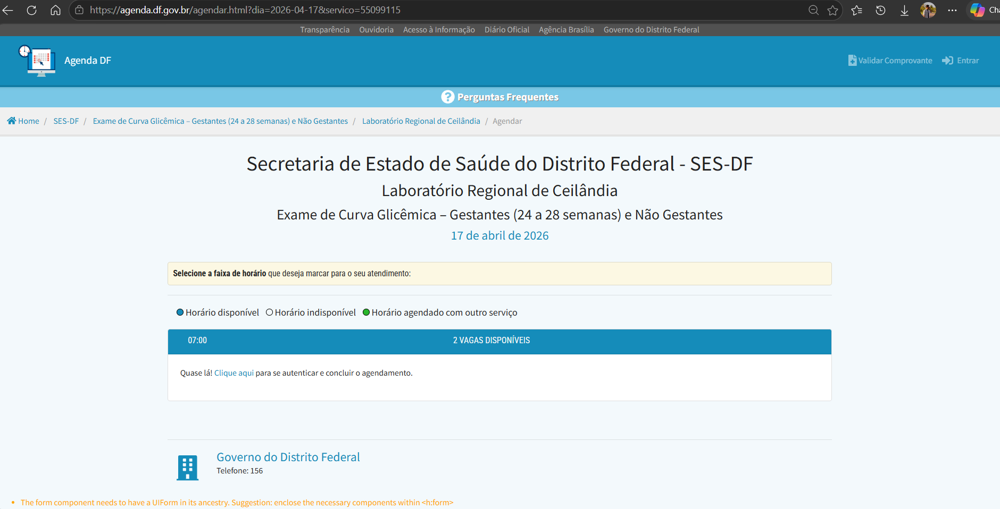
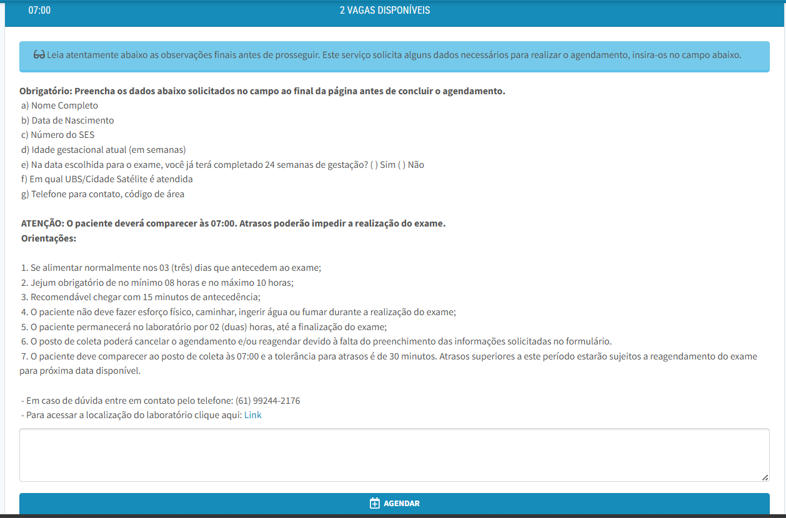
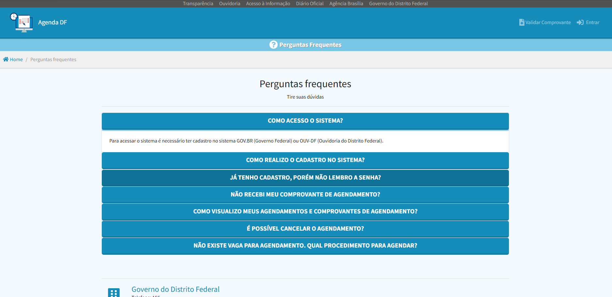

## Avaliação do site escolhido

Essa etapa da avaliação possui foco no conformidade com o padrão W3C para acessibilidade.
Avaliação Heurística do site de agendamento exame de curva glicêmica para Gestantes (24 a 48 semanas) e não gestantes, incluindo crianças, mediante solicitação médic _(Agenda-DF, SES-DF, acessado dia 10/04/2026)_

## 1- Etapa de Preparação: 

- **Objetivos da avaliação:** O objetivo principal é verificar se o site atende à conformidade com o padrão W3C para acessibilidade. A avaliação focará em descobrir se o design adotado possui ferramentas de acessibilidade adequadas e se facilita a operação para o público-alvo na realização de agendamentos de exame de curva glicêmica.

- **Escopo da Avaliação (O que avaliar)**: A parte da interface selecionada para inspeção é o Formulário de requisição de agendamento. 

- **Situação Atual e Domínio do Sistema:** O serviço avaliado possibilita que os usuários agendem exames antecedência, importante pare o acompanhamento pré-natal.

- **Definição do Usuário e do Problema** Para simular o papel dos usuários de forma eficaz, a inspeção baseia-se no seguinte perfil e contexto de uso: 

  - **Perfil do Usuário-Alvo:** O sistema tem como foco gestantes e não gestantes com grau baixa experiência com tecnologia que precisa realizar um agendamento de exame glicêmico.

  - **Tarefas do Usuário:** O usuário deve selecionar a disponível que melhor lhe atende para executar seu agendamento.

  - **Requisições e Reclamações:** O usuário deseja agendar uma visita, mas relata dificuldade em compreender a plataforma e sente que os recursos de apoio oferecidos não são suficientes, por isso desiste.

  - **Comportamento do Stakeholder:** O usuário enfrenta dificuldades ao realizar o atendimento quando esse demanda recursos especiais de acessibilidade, uso de leitores de tela 

## 2- Etapa de coleta de dados, interpretação e consolidação de resultados: 

1. **Caminho da Interação** Selecionado Para a avaliação, o avaliador percorrerá o seguinte caminho de interação:
    1. Acesso ao site do Agenda DF (https://agenda.df.gov.br/index.html). E buscar nos quadros disponíveis o quadro correspondente à "Secretaria de Estado de Saúde do Distrito Federal SES-DF".
        <div>
            
            
        </div>

    2. Fazer o Login com a conta GOV.BR. 

    3. Acessar “Exame de curva glicêmica - Gestantes (24 a 28 semanas) e Não Gestantes” no quadro de serviços.
        <div>
            
        </div>
    4. Selecionar a unidade de atendimento "Laboratório Regional de Ceilândia".
    
    

    5. Selecionar a Data disponível de acordo com o calendário exibido na tela.
    
    

    6. Selecionar o horário disponível.
    
    

    7. Preencher o campo de texto com as informações requisitadas no parágrafo de texto acima do campo.
    
    
    
# Avaliação Heurística

### Homepage

Considere os seguinte fragmentos de tela do site AgendaDF:

O relatório a seguir ilustra a descrição das violaões resultante da avaliação heurstica. 
Observe que alguns problemas constituem violação de mais de uma heurística. (Barbosa e Silva, 2010, p. 313). 

a severidade dos problemas seguirá a seguinte escala numérica (Barbosa e Silva, 2010, p. 313). 
```
1: problema cosmético – não precisa ser consertado a menos que haja tempo no 
cronograma do projeto;

2: problema pequeno – o conserto deste problema pode receber baixa prioridade;

3: problema grande – importante de ser consertado e deve receber alta prioridade. 
Esse tipo de problema prejudica fatores de usabilidade tidos como impor
tantes para o projeto (por exemplo, s o exigidos muitos passos de intera o 
para alcanar um objetivo que deveria ser atingido de forma efi ciente);

4: problema catastrófico –  extremamente importante consert-lo antes de se 
lanar o produto. Se mantido, o problema provavelmente impedir que o 
usurio realize suas tarefas e alcance seus objetivos.
```

### Página principal do AgendaDF



- **Visibilidade do estado do sistema, projeto estético e minimalista**: Não existe em nenhum local algum idicativo de disponibilidade do sistema — _Sistema online_ —. Há bastante espaço em branco na barra do sistema, que faz o título tomar epsço útil da tela de conteúdo.O tamanho de fonte do texto expliativo é demasiadamente pequeno, o que pode passar despercebido pelo usuário.
    - **Local:** Texto logo abaixo do título da página e barra superior do sistema
    - **Severidade :** 1, O Usuário não sabe se o sistema de agendamento está ativo.
        - **Frequência:** Problema comum.
        - **Impacto:** Baixo.
        - **Persistência:** Acontece repetidamente.

    - **Recomendação:** Colocar na barra superior algum elemento para indicar a disponibilidade do sistema. Ajustar a barra de título.

## Página de seleção de serviços SES-DF:



- **Correspondência com o mundo real, projeto estético**: O tamanho da caixa de textos não é padronizado, há uso de termos que são conhecidos para usuários que possuem familiaridade com o universo da saúde, porém pode dificultar a compreensão para o usuário que não esteja acostumnado.
    - **Local:** Quadro de serviços.
    - **Severidade :** 2 (problema grande), Usuários mais leigos podem desconhecer ou se confundir com os termos. E o excesso de texto por caixa pode dificultar a leitura do usuário com dificuldade visual.
        - **Frequência:** Problema comum.
        - **Impacto:** Médio.
        - **Persistência:** Acontece repetidamente.
    - **Recomendação:** Limitar a quantidade de texto por caixa, diferenciar os serviços por categoria/especialidade e evitar uso de termos especpificos do universo de medicina.


## Página de seleção de unidade de atendimento. 



- **Projeto estético minimalista**: Como esse serviço é ofertado em apenas uma unidade de saúde (somente no laboratório de Ceilândia), não há necessidade de uma página dedicada somente para uma opção.
    - **Local:** Página de seleção de unidade.
    - **Severidade :** 2, O Usuário pode ter usa jornada encurtada caso essa etapa seja removida.
        - **Frequência:** Problema comum.
        - **Impacto:** Médio.
        - **Persistência:** Acontece repetidamente.
    - **Recomendação:** Remover essa etapa, já que esse serviço é ofertado somente nessa unidade.


## Página de calendário (seleção de data do atendimento)



- **Visibilidade do estado do sistema, Flexibilidade de controle, reconhecimento em vez de memorização:** O calendário possui apenas uma legenda simples com pequenas bolinhas coloridas para que o usuário memorize a cor corresspondete à disponibilidade de vagas. Não há uma forma mais intuitiva de selecionar a data desejada
    - **Local:** Calendário de seleção de agendamento. 
    - **Severidade:** 3, Usuários com dificuldade visual ou com daltonismo terão dificuldades de reconhecer rapidamente as datas com vagas disponíveis. O sistema não fornece alternativas de uso nessa etapa e também não fornce feedback audiovisual sobre as datas disponíveis e selecionadas.
    - **Frequência:** Problema comum.
        - **Impacto:** Baixo.
        - **Persistência:** Acontece repetidamente.
    - **Recomendação:** incluir sistema de alteração de cores (daltonismo), incluir opção de visualização de datas disponíveis por lista.


## Página de seleção de horário



- **Consistência e padronização, prevenção de erros:** Há pouco destaque no texto informativo de ação, e também ao confirmar o horário o sistema pede para efetuar o login e retorna para a página principal (caso o usuário não houvesse realizado o login ateriormente), que quebra o fluxo do usuário.
    - **Local:** página de seleção de horário.
    - **Severidade:** 3, esse problema é bastante crítico pois o usuário pode se frustrar com o uso do sistema e desistir.
        - **Frequência:** Problema comum.
        - **Impacto:** Alto.
        - **Persistência:** Acontece repetidamente.
    - **Recomendação:** solicitar o login na primeira etapae melhorar o contraste e tamanho do texto.


## Formulário de informações para agendamento


-  **Flexibilidade e eficiência de uso, consistência e padronização, prevenção de erros:** Essa parte do sistema apenas possui um texto que solicita alguns dados do usuário, mas o campo de entrada das informações não é de dadsos estruturados, é apenas um campo de texto simples. Além de já mostrar orientações da consulta ainda nessa etapa.
    - **Local:** Preenchimento de formulário 
    - **Severidade:** 3, esse problema é considerado gran para usuaários que possuam alguma preferência para sites com entradas de informações mais organizadas e esturutradas.
        - **Frequência:** Problema comum.
        - **Impacto:** Alto.
        - **Persistência:** Acontece repetidamente. 
    - **Recomendação:** Oferecer diferentes métodos de entrada no formulário como listas, menu suspenso, checkboxes e travas de campos obrigatórios para auxuiliar ao usuário a preencher corretamente.


## Página de finalização


-  **Flexibilidade e eficiência de uso, consistência e padronização, prevenção de erros:** A página final mostra todas as informações contidas do formulário, o que pode poluir a leitura.
    - **Local:** Página de encerramento
    - **Severidade:** 2, Pode haver confusão de informações por parte do usuário.
        - **Frequência:** Problema comum.
        - **Impacto:** Alto.
        - **Persistência:** Acontece repetidamente. 
    - **Recomendação:** Inserir cards com os atendimentos e a opção clicável para o usuário ver os detalhes dos cards de atendimento.


## Página de Ajuda/perguntas frequentes



-  **Ajuda e documentação:** A página de ajuda e perguntas frequentes não possui ajuda para itens específicos do sistema que possa auxiliar ao usuárui quanto a sua operação.
    - **Local:** Página de ajuda
    - **Severidade:** 2, Pode haver confusão de informações por parte do usuário.
        - **Frequência:** Problema comum.
        - **Impacto:** Alto.
        - **Persistência:** Acontece repetidamente. 
    - **Recomendação:** inserir botão de ajuda em partes/elementos específicos ao longo da jornada de tarefa do usuário. Detalhar melhor a documentação de uso.


# Consolidação de resultado

A avaliação em questão tem como objetivo verificar a conformidade de acessibilidade com o W3C, no processo de realização de agendamento de exame de glicemia para gestantes. Como o próprio livro de Iteração Humano Computador sugere, para esse tipo de análise, há a dispensa de recurtamento e participação de usuários, e recorre-se à no máximo 5 avaliadores

Em resumo, pôde-se observar um padrão de falhas no atendimento às normas do W3C como a falta de opção de contraste de cores e cores alternativas para daltonismo, ajuste de tamanho de fonte, pouco contraste ou escala relativa de elementos diferentes, facilidade na intergração com agentes leitores de tela e descrição de imagens (alt-text).

### Lista de problemas encontrados:
- Falta de integração com agentes leitores de tela.
- Falta de funcão de ajuste de cores e tamanho de texto.
- Escala incorreta relativa entre elementos da página como texto de instruções e conteúdo.
- Falta de funcionalidade de leitura em Libras pré-gravadas.


```
Nota de rodapé:

1 Acessibilidade: possibilidade de leitura com o agente de usuário. O Agente de Usuário referese ao software para ter acesso ao conteúdo web. Inclui navegadores gráficos, navegadores de texto, navegadores de voz, celulares, leitores de multimídia, suplementos para navegadores, como os leitores de tela e os programas de reconhecimento de voz.  Se um Agente de Usuário, como, por exemplo, um navegador ou um leitor de telas, não detectar o tipo de codificação de caracteres usado no documento web, o usuário corre o risco de ter em seu site um texto ininteligível.

2 Usabilidade: produtividade, eficiência de uso e funcionalidade do ambiente – facilidade de acesso para TODOS.

3 Comunicabilidade: processo de comunicação desenvolvedorusuário; mede o nível de compreensão do usuário. É preciso que o usuário compreenda cada evento contido na interface, que os dados informações presentes na mesma sejam transmitidos com clareza
```


# Referências bibliográficas:

DISTRITO FEDERAL. Serviço de Agendamentos do Distrito Federal. Brasília, DF: Governo do Distrito Federal, [2026]. Disponível em: https://agenda.df.gov.br/meus_agendamentos.html. Acesso em: 11 abr. 2026.

W3C. Essential Components of Web Accessibility. [S. l.], [202-?]. Disponível em: https://www.w3.org/WAI/fundamentals/accessibility-principles/#standards. Acesso em: 11 abr. 2026.

W3C. Web Content Accessibility Guidelines (WCAG) 2.0. Recomendação W3C de 11 dez. 2008. [S. l.], 2008. Disponível em: https://www.w3.org/TR/WCAG20/. Acesso em: 11 abr. 2026.

W3C. Web Content Accessibility Guidelines (WCAG) 2.2. Recomendação W3C de 12 dez. 2024. [S. l.], 2024. Disponível em: https://www.w3.org/TR/WCAG22/. Acesso em: 11 abr. 2026.