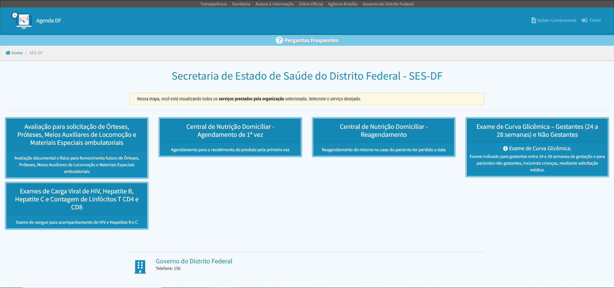

# Site selecionado para o projeto da disciplina

## Introdução
Para a definição do objeto de estudo deste projeto, a equipe realizou um levantamento de diversos portais, analisando os pontos que serão detalhados adiante para fundamentar a decisão pelo site escolhido.

<em>Figura 1: Interface de seleção de serviços da SES-DF (Fonte: Agendamento Distrito Federal, 2026).</em>

## Objetivo
Este artefato tem como finalidade descrever a plataforma selecionada e apresentar as justificativas que motivaram essa escolha.

## Critérios para a escolha
Em reunião, os integrantes do grupo definiram a escolha do site com base nos requisitos listados abaixo:
* Site ainda não explorado em atividades anteriores da disciplina de Interação Humano-Computador.
* Plataforma pertencente a órgão governamental (Secretaria de Saúde - GDF).
* Pertinência do sistema para os objetivos de aprendizado da disciplina.
* Nível de complexidade adequado em relação às etapas de interação e processos de marcação.
* Facilidade de acesso público às informações e funcionalidades do sistema.
* Compatibilidade do site com as competências técnicas e interesses de pesquisa da equipe.

## Motivação da escolha
A principal motivação para a escolha se deve aos problemas de interação e interface identificados. Pois, por ser um serviço essencial voltado a um público sensível, composto por gestantes, a interface deveria priorizar a redução da carga cognitiva e a prevenção de erros. Porém, a plataforma não apresenta uma navegação muito intuitiva além de uma hierarquia visual ineficiente, o que o torna ideal para a aplicação das técnicas de IHC. Dessa forma, O grupo busca diagnosticar esses problemas propor soluções que tornem o agendamento mais intuitivo e acessível.

## Site Selecionado
Inicialmente, o grupo considerou outras plataformas de serviços públicos, porém, ao avaliarmos a importância do atendimento especializado, optou-se pelo portal de **Agendamento Eletrônico dos Exames de Curva Glicêmica para Gestantes**. Trata-se de um sistema do Governo do Distrito Federal focado em organizar a demanda por exames laboratoriais essenciais durante o pré-natal.

O sistema (Figura 1) tem como propósito principal facilitar o acesso das pessoas à marcação de exames remotamente. Assim, Dentre suas funcionalidades, destacam-se a escolha de locais de atendimento, consulta de horários disponíveis e orientações sobre os pré-requisitos para a realização do exame de glicemia.

Após a definição do site, a equipe realizou uma inspeção preliminar e elencou os seguintes pontos:

**Pontos Positivos:**
* Promoção da cidadania digital e saúde pública;
* Centralização de informações sobre o preparo para o exame;
* Disponibilidade de múltiplos postos de coleta em um único portal.

**Pontos Negativos:**
* Interface visual datada e pouco atrativa;
* Jornada do usuário complexa, podendo gerar confusão no preenchimento dos dados;
* Disposição de informações de forma pouco hierarquizada, dificultando a leitura rápida.

Para uma compreensão aprofundada das falhas de interface, a análise heurística detalhará cada um desses problemas em artefatos futuros.

## Bibliografia
[1] DISTRITO FEDERAL. Secretaria de Saúde. Agendamento Eletrônico. Disponível em: https://agenda.df.gov.br/organizacao.html?organizacao=39643613. Acesso em: 11/04/2026.

[2] Barbosa, S. D. J.; Silva, B. S. da; Silveira, M. S.; Gasparini, I.; Darin, T.; Barbosa, G. D. J. (2021)
Interação Humano-Computador e Experiência do usuário. Autopublicação.

## Contribuidores

| Nome do Contribuidor |
| :--- |
| [Pedro Henrique](https://github.com/PedroGTG) |
| [Samuel Leite](https://github.com/osamuelleite) |

## Histórico de Versões

| Data | Versão | Descrição | Autor | Revisor |
| :--- | :--- | :--- | :--- | :--- |
| 11/04/2026 | 1.0 | Elaboração do artefato de seleção do site | Pedro | Samuel |