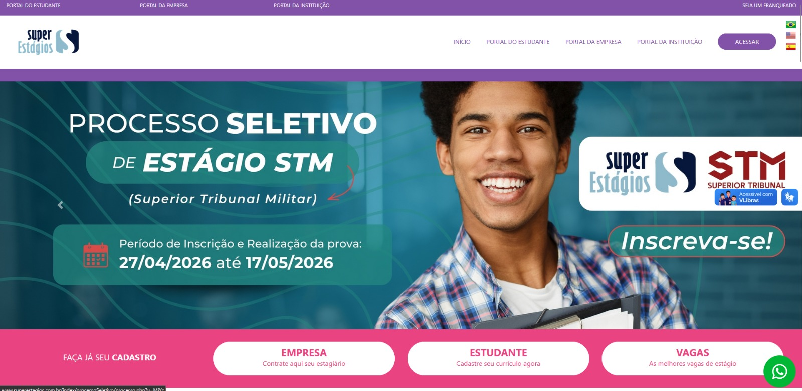
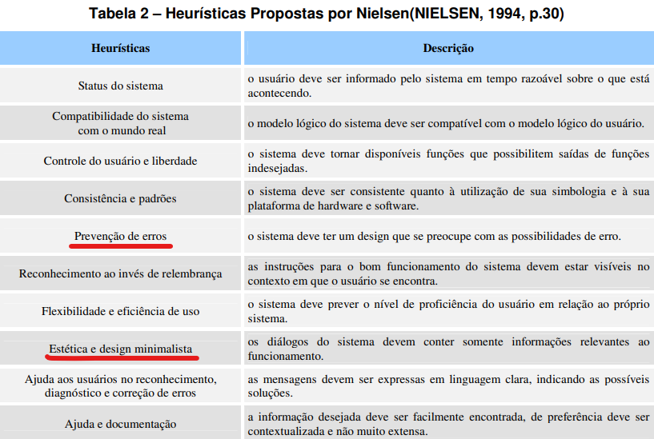

# Site selecionado para o projeto da disciplina

## Introdução
Para a definição do objeto de estudo deste projeto, a equipe realizou um levantamento de diversos portais, analisando os pontos que serão detalhados adiante para fundamentar a decisão pelo site escolhido.

<em>Figura 1: Página inicial do Super Estágios (Fonte: superestagios.com.br, 2026).</em>

## Objetivo
Este artefato tem como finalidade descrever a plataforma selecionada e apresentar as justificativas que motivaram essa escolha.

## Critérios para a escolha
Em reunião, os integrantes do grupo definiram a escolha do site com base nos requisitos listados abaixo:
* Site ainda não explorado em atividades anteriores da disciplina de Interação Humano-Computador.
* Plataforma privada de acesso público voltada à intermediação de estágios.
* Pertinência do sistema para os objetivos de aprendizado da disciplina.
* Nível de complexidade adequado em relação às etapas de interação e aos fluxos de busca e candidatura a vagas.
* Facilidade de acesso público às informações e funcionalidades do sistema.
* Compatibilidade do site com as competências técnicas e interesses de pesquisa da equipe.

## Motivação da escolha
A principal motivação para a escolha se deve aos problemas de interação e interface identificados. Por ser um serviço voltado a estudantes em busca de oportunidades profissionais, a interface deveria priorizar clareza, eficiência e prevenção de erros. Porém, a plataforma apresenta navegação pouco intuitiva, ausência de máscaras de entrada em formulários e hierarquia visual ineficiente, o que a torna ideal para a aplicação das técnicas de IHC. Dessa forma, o grupo busca diagnosticar esses problemas e propor soluções que tornem o processo de busca e candidatura a vagas mais intuitivo e acessível.

<em>Figura 2: Heurísticas de Nielsen (Fonte: Nielsen, 1994).</em>

## Site Selecionado
Inicialmente, o grupo considerou outras plataformas de serviços voltados a estudantes, porém, ao avaliarmos a relevância e o alcance nacional da plataforma, optou-se pelo portal **Super Estágios**. Trata-se de uma plataforma privada fundada em 2009, focada na intermediação entre estudantes, empresas e instituições de ensino para a oferta e gestão de vagas de estágio em todo o Brasil.
 

<em>Figura 3: Formulário de busca de vagas do Super Estágios com campos Estado, Cidade, Escolaridade e Curso (Fonte: superestagios.com.br, 2026).</em>

 
O sistema tem como propósito principal facilitar o acesso de estudantes à busca e candidatura a vagas de estágio de forma gratuita. Dentre suas funcionalidades, destacam-se a busca de vagas por curso, cidade e estado, o cadastro de currículo do estudante e a candidatura direta às oportunidades disponíveis.

Após a definição do site, a equipe realizou uma inspeção preliminar com base nas heurísticas de Nielsen (ver [Figura 2](#figura-2)) e elencou os seguintes pontos:

**Pontos Positivos:**
* Acesso gratuito para estudantes com grande volume de vagas disponíveis;
* Centralização de oportunidades de diversas áreas e regiões do Brasil;
* Disponibilidade de filtros de busca por curso, cidade e estado em um único portal.

**Pontos Negativos:**
* Interface visual datada e pouco atrativa;
* Formulários sem máscaras de entrada e sem indicação clara de campos obrigatórios;
* Cards de vagas com informações insuficientes, exigindo múltiplos cliques para triagem básica.

Para uma compreensão aprofundada das falhas de interface, a análise heurística detalhará cada um desses problemas em artefatos futuros.

## Bibliografia
[1] SUPER ESTÁGIOS. **Portal Super Estágios**. Disponível em: https://www.superestagios.com.br. Acesso em: 01 maio 2026.

[2] BARBOSA, S. D. J.; SILVA, B. S. da; SILVEIRA, M. S.; GASPARINI, I.; DARIN, T.; BARBOSA, G. D. J. **Interação Humano-Computador e Experiência do Usuário**. 1. ed. Autopublicação, 2021.

[3] MACIEL, C.; NOGUEIRA, J. L. T.; CIUFFO, L. N.; GARCIA, A. C. B. Avaliação Heurística de Sítios na Web. Niterói: Instituto de Computação, Universidade Federal Fluminense (UFF), [2004]. Disponível em: <https://marcelohsantos.com/aulas/include/2022-1/projeto_Interface_Usuario/Aula7_artigo.pdf>. Acesso em: 12 abr. 2026.

## Contribuidores

| Nome do Contribuidor |
| :--- |
| [Pedro Henrique](https://github.com/PedroGTG) |
| [Samuel Leite](https://github.com/osamuelleite) |
| [Luís Oliveira](https://github.com/Luiskr34) |

## Histórico de Versões

| Data | Versão | Descrição | Autor | Revisor |
| :--- | :--- | :--- | :--- | :--- |
| 11/04/2026 | 1.0 | Elaboração do artefato de seleção do site | Pedro | Samuel |
| 12/04/2026 | 1.1 | Revisão e ajustes | Pedro Henrique | Samuel Leite |
| 01/05/2026 | 1.2 | Atualização da análise de site para o Super Estágios | Luís Oliveira | Pedro |